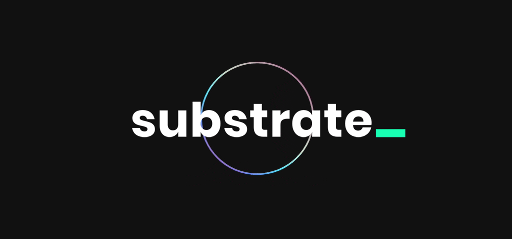

<h1 align="center">
  <a href="https://www.substrate.io">
    
  </a>
</h1>
<h1 align="center"> Substrate Developer Hub SANDBOX </h1>
<h3 align="center"> <a href="https://substrate-developer-hub.github.io/docs-sandbox/">https://substrate-developer-hub.github.io/docs-sandbox/</a> </h3>
<br/>

This repository serves as the **developer hub SANDBOX** for the **[Substrate](https://substrate.io)** blockchain framework.
The docs are written in pure [markdown](https://www.markdownguide.org/), processed by [MKdocs](https://www.mkdocs.org/).

## 🦾 Docs Migration Instructions:

The `./old-docs-migration` folder has all the ported docs, renamed for convenience to be `.md` files via [this method](#bash-file-migration-magic).

Now our mission, if we choose to accept it... (we do!), is to port all the files in `./old-docs-migration` into the new **framework** outlined in our team Notion:

- [Notion Documentation Plan](https://www.notion.so/paritytechnologies/Documentation-plan-dcb201be22474ee294a9078e29b1e97a).

The framework will be implemented in the `./source/docs` folder.

### 📑 Workflow

1. Select a _new_ page you want to write, and mark youself as managing this in the [tracker spreadsheet](https://docs.google.com/spreadsheets/d/1cdUK7fPV9CIHG9Xi1P31FHwGM3TTd3BUNd_-8sVNNUA/edit#gid=1810433834)
1. Make a new file in the `/source/docs` dir for this work _or_ drag a page from `./old-docs-migration` into the right place in the `/source/docs` dir.
1. **Cut** the contents of any file that you are migrating from `./old-docs-migration` into the `/source/docs` files so that it **no longer remains in the `./old-docs-migration` files**.
1. **Delete** any duplicated content in `./old-docs-migration` you run into while pulling from multipole locations.
1. **Selectively reword as needed** existing content in `/source/docs` when you find it already in place in `./old-docs-migration`. The *delete it from `./old-docs-migration`.

**This way our definition of done with the migration is when `./old-docs-migration` is empty!**

## 🚀 Quick start

1. Clone the repo

   ```bash
   # create a new folder to get going
   git clone git@github.com:substrate-developer-hub/docs-sandbox.git
   ```

1. Install `mkdocs`

    https://www.mkdocs.org/getting-started/

1. Serve the site

   ```bash
   # move to the source dir that includes `mkdocs.yml`
   cd docs-sandbox/source
   # options for `--theme [mkdocs|material|readthedocs]`
   mkdocs serve
   ```

    The site should be ready to view at <http://127.0.0.1:8000/> and/or <http://localhost:8000/>

1. Make edits...

1. Update `source/mkdocs.yml` to render site

   Should be relatively self explanatory

   ```yml
   # Navigation
   nav:
     - 'Some section':
       - 'Page Title': 'some/path/to-a-file.md'
       - 'Subsection':
         - 'some/path/to-a-file.md
   ```

1. See they changes look nice and there are no `mkdocs serve` warnings/errors...

1. Commit changes...

1. Make a PR...

1. Deploy to `gh-pages`

   ```bash
   mkdocs gh-deploy
   ```

1. Profit 😎

## License

TBD

<!-- Substrate **documentation** is license under the [Apache 2 license](./LICENSE). -->

---

### `bash` file migration magic

To migrate old `v3` dir dumped into `old-docs-migration`

To get old dir `<folder>/index.mdx` to `<folder>.md`:

```bash
# move all `<folder>/index.mdx` to `<folder>.md`
find ./ -depth -name "*.mdx" -exec sh -c 'mv $1 "${1%/index.mdx}.md"' _ {} \;
# delete all empty folders
find /path/ -empty -type d -delete
```
