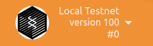
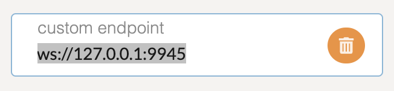
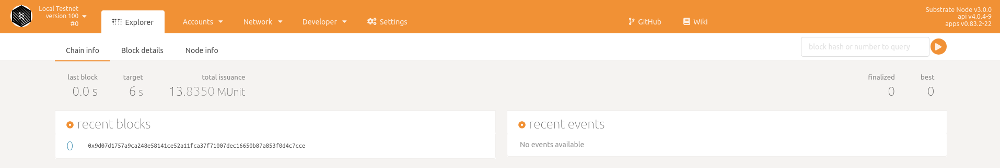

### Connect to a different network

To use Polkadot-JS Explorer to connect to another node:

1. Click the network icon displayed in the top left corner of the Polkadot-JS Explorer page.

  <!---->

1. Expand **DEVELOPMENT** at the bottom of the list of networks available.

  <!---->

1. Verify the custom endpoint is set to `ws://127.0.0.1:9945`.

1. Connect to another node and port by specifying a different IP address or host name and port number for the custom endpoint.
  
  You can use a single instance of the Polkadot-JS application to connect to various nodes. 

1. Click **Switch** to change to the new custom endpoint.

  <!---->

You should now see something like this example on the **Network** page.

<!---->
