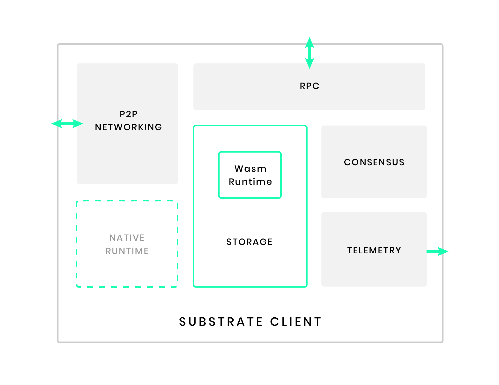

<!--
Notes / stuff to add:
- On how light clients work: https://github.com/paritytech/substrate/issues/5047#issuecomment-638708536

Add section on Design assumptions:
- all blockchains must run on "minimum hardware requirements" 
- protocol vs. infrastructure
-->

A Substrate node is designed to be modular and adaptable to change. 
This article presents the architecture of a Substrate node, using the [node template](https://github.com/substrate-developer-hub/substrate-node-template) as a reference whicih provides a set of core components ready to use out of the box.
Any of these components can be swapped out for different ones, depending on the target optimization or use case.

The architecture of a Substrate contains:

- **[A runtime](#runtime)**: the logic that defines how blocks are processed, including state transition logic. 
In Substrate, runtime code is compiled to [Wasm](/v3/getting-started/glossary#webassembly-wasm) and becomes part of the blockchain's storage state. 
This enables [forkless runtime upgrades](/v3/runtime/upgrades#forkless-runtime-upgrades). 
Substrate clients can also include a "native runtime". 
Everything responsible for handling on-chain logic and state persistence happens in the runtime.
- **[A storage component](#storage)**: used to persist the evolving state of a Substrate blockchain.
Substrate ships with a simple and highly efficient [key-value storage mechanism](/v3/advanced/storage).
- **[An executor](#executor)**: the component of the client that dispatches calls to the runtime is known as the [executor](/v3/advanced/executor), whose role is to select between the native code and interpreted Wasm. 
The executor will select to interpret the Wasm runtime if it implements a newer [version](/v3/runtime/upgrades#runtime-versioning).
- **A network layer**: the capabilities that allow the client to communicate with other network participants. 
Substrate uses the Rust implementation of the [`libp2p` network stack](https://libp2p.io/).
- **A consensus engine**: the logic that allows network participants to agree on the state of the blockchain.
Substrate makes it possible to supply custom consensus engines and also ships with several consensus mechanisms that have been built on top of [Web3 Foundation research](https://w3f-research.readthedocs.io/en/latest/index.html).
- **An RPC API**: the capabilities that allow blockchain users to interact with the network. 
Substrate provides HTTP and WebSocket RPC servers.
- **A telemetry layer**: client metrics that are exposed by the embedded [Prometheus](https://prometheus.io/) server.

## Runtime

The runtime contains the business logic of the chain. 
It defines what transactions are valid and invalid and determines how the chain's state changes in response to transactions. 

The "outer node", everything other than the runtime is responsible for handling peer discovery, transaction pooling, block and transaction gossiping, consensus, and answering RPC calls from the outside world. 
While performing these tasks, the outer node sometimes needs to query the runtime for information, or provide information to the runtime. 
### Runtime APIs and host functions

The host functions and runtime APIs provide a means to deliver messages being passed between the runtime and the client. 
Substrate can facilitate a number of runtime implementations without needing to alter the host functions and runtime APIs that come out of the box.

A **host function** is a function that is expressed outside of the runtime but passed in as an import to the runtime. 
One example is the benchmarking implementation in FRAME.
[Benchmarking host functions](https://docs.substrate.io/rustdocs/latest/frame_benchmarking/benchmarking/struct.HostFunctions.html) are required to extract benchmarks generated by the hardware running the node.

A **runtime API** facilitates communication between the outer node and the runtime.
For example, benchmarking requires a [runtime API](https://docs.substrate.io/rustdocs/latest/frame_benchmarking/trait.Benchmark.html) as well.

It is also possible to [design custom "runtime API / host function" interfaces](./link-todo-design) in Substrate.
### Native and Wasm runtimes

In order to provide its defining forkless runtime upgrade capabilities, Substrate runtimes are compiled to [WebAssembly (Wasm)](/v3/getting-started/glossary#webassembly-wasm) bytecode. 

Considered an optimization to Substrate, the native runtime is especially useful for development and testing environments.
It is optional in the sense that production chains don't need to rely on native builds.
The Wasm runtime on the other hand is not optional. 
A chain's Wasm binary is embedded in the client at compile time and required for any [chain specification](./todo).
It is possible to skip the Wasm runtime compilation for developement purposes.
However, launching a chain without one will cause the the chain will panic.
Being a core component to Substrate's design, it provides the possibility for on-chain upgradability and relay chain validation.

There are ongoing discussions about removing the native runtime altogether. 
Refer to this open [issue](https://github.com/paritytech/substrate/issues/7288) for more details.

Here are some reasons why using a native runtime could be desired:

- For development and testing, native runtimes have better debugging support, while Wasm runtimes are more difficult to debug.
- Native execution is faster than Wasm execution and more efficient on slower hardware.

However:

- The Wasm runtime is required in all Substrate chains.
- The Wasm runtime is the canonical encoding of the chains' state transition functions, which implies that something that isn't supported by a Wasm runtime won't be supported by the native runtime.
- In production, on-chain upgrades can only be done with Wasm runtimes.

## Storage

Substrate uses a simple key-value data store implemented as a database-backed, modified [Merkle tree](https://en.wikipedia.org/wiki/Merkle_tree).
This allows any higher-level storage abstraction to be built ontop of this simple key-value storage layer.
All events, extrinsics and pallet logic use this storage layer to persist state on-chain.
For example, the Wasm runtime of a Substrate chain is stored at the magic key [`:code`](https://docs.substrate.io/rustdocs/latest/sp_storage/well_known_keys/constant.CODE.html).
User balances are stored as a [`StorageMap`](https://docs.substrate.io/rustdocs/latest/frame_support/storage/trait.StorageMap.html) which uses the key-value database.

This layer is built using the Rust implementation of [Rocks DB](http://rocksdb.org/).
There is a different implementation under developement called [Parity DB](https://github.com/paritytech/parity-db), also built in Rust but aims to optimize storage and retrieval of state data. In any case, Substrate is designed to support any key-value database implementation. 

[ TODO: Elaborate on storage layers, including externalities]

**Trie abstraction**

Substrate uses a Base-16 Modified Merkle Patricia tree ("trie") from
[`paritytech/trie`](https://github.com/paritytech/trie) to provide a trie structure whose contents can be modified and whose root hash is recalculated efficiently.

Substrate-based chains have a single main trie, called the state trie, whose root hash is placed in each block header. 
This is used to easily verify the state of the blockchain and provide a basis for light clients to verify proofs.

This trie only stores content for the canonical chain, not forks. 
There is a separate [`state_db` layer](/rustdocs/latest/sc_state_db/index.html) that maintains the trie state with references counted in memory for all non-canonical blocks.
All trie nodes are stored in the database and part of the trie state can get pruned, i.e. a key-value pair can be deleted from storage when it is out of pruning range for non-archive nodes. 

Substrate also provides an API to generate new [child tries](./todo-link-design) with their own root hashes that can be used in the runtime.
Learn about ways to design and implement the storage for your chain [here](./todo-link-design).

## Executor

The [executor](/v3/getting-started/glossary#executor) is responsible for dispatching and executing calls into the Substrate runtime.

The native runtime is included as part of the node executable, while the Wasm binary is stored on the blockchain under a [well known storage key](https://docs.substrate.io/rustdocs/latest/sp_storage/well_known_keys/index.html).
These two representations of the runtime may not be the same. 
After the runtime is upgraded, the executor determines which version of the runtime to use when dispatching calls.

Before runtime execution begins, the Substrate client proposes which runtime execution environment should be used. 
This is controlled by the execution strategy, which can be configured for the different parts of the blockchain execution process. 
The strategies are listed in the [`ExecutionStrategy` enum](/rustdocs/latest/sp_state_machine/enum.ExecutionStrategy.html):

- `NativeWhenPossible`: Execute with native build (if available, WebAssembly otherwise).
- `AlwaysWasm`: Only execute with the WebAssembly build.
- `Both`: Execute with both native (where available) and WebAssembly builds.
- `NativeElseWasm`: Execute with the native build if possible; if it fails, then execute with WebAssembly.

All strategies respect the runtime version, meaning if the native and Wasm runtime versions differ, the Wasm runtime is chosen.
These are configurable using Substrate's [CLI](./link-to-build-cli).

**Wasm execution**

The Wasm representation of the Substrate runtime is considered the canonical runtime. 
Because this Wasm runtime is placed in the blockchain storage, the network must come to consensus about this binary. 
Thus it can be verified to be consistent across all syncing nodes.

The Wasm execution environment can be more restrictive than the native execution environment. 
For example, the Wasm runtime always executes in a 32-bit environment with a configurable memory limit (up to 4 GB).

For these reasons, the blockchain prefers to do block construction with the Wasm runtime. 
Some logic executed in Wasm will always work in the native execution environment, but the same cannot be said the other way around. 
Wasm execution can help to ensure that block producers create valid blocks.

**Native execution**

The native runtime will only be used by the executor when it is chosen as the execution strategy and it is compatible with the requested runtime version (see [Runtime Versioning](/v3/runtime/upgrades#runtime-versioning)).
For all other execution processes other than block construction, the native runtime is preferred since it is more performant. 
In any situation where the native executable should not be run, the canonical Wasm runtime is executed instead.

## Primitives

The Substrate framework makes minimal assumptions about what your runtime must provide to the other layers of Substrate.  
As long as the runtime has primitives that are mutually understood by the client, it can execute its logic. 
These primitives can be broken down into two categories: everything enabling the implementation of a protocol (core primitives) and the protocol itself.

**Core primitives** are the data types that need to be defined and must fulfill a particular interface in order to work within the Substrate framework.

These are:

- `Hash`: A type which encodes a cryptographic digest of some data. Typically just a 256-bit
  quantity.

- `DigestItem`: A type which must be able to encode one of a number of "hard-wired" alternatives
  relevant to consensus and change-tracking as well as any number of "soft-coded" variants, relevant
  to specific modules within the runtime.

- `Digest`: A series of DigestItems. This encodes all information that is relevant for a
  light-client to have on hand within the block.

- `Extrinsic`: A type to represent a single piece of data external to the blockchain that is
  recognized by the blockchain. This typically involves one or more signatures, and some sort of
  encoded instructions (e.g. for transferring ownership of funds or calling into a smart contract).

- `Header`: A type which is representative (cryptographically or otherwise) of all information
  relevant to a block. It includes the parent hash, the storage root and the extrinsics trie root,
  the digest and a block number.

- `Block`: Essentially just a combination of `Header` and a series of `Extrinsic`s, together with a
  specification of the hashing algorithm to be used.

- `BlockNumber`: A type which encodes the total number of ancestors any valid block has. Typically a
  32-bit quantity.

**Protocol primitives** are a more abstract class of primitives. 
They are typically informed by consensus critical components which define the relationship between a client and a runtime.
These relate to implementations of [runtime APIs and host functions](#runtime-apis-and-host-functions), whereby any consensus-breaking change on the host-function must be reflected in the runtime. 

Adhering to some set of protocol primitives is necessary for chains connecting to eachother such as in Polkadot's parachain model.
For example, [the Polkadot protocol](https://github.com/w3f/polkadot-spec/) specifies host functions and runtime APIs in its implementation for block authoring (BABE) and block finalization (GRANDPA).
Any parachain that uses the Polkadot protocol must also expose the same runtime APIs and host functions.
Similarly, any change in Polkadot's runtime APIs or host functions must be reflected in the parachain, otherwise there is no way for a relay chain and a parachain to reach consensus.

This architecture makes it possible to implement any Substrate runtime, using any language or libraries provided that it adheres to the protocol and primitives it shares with the client. 
