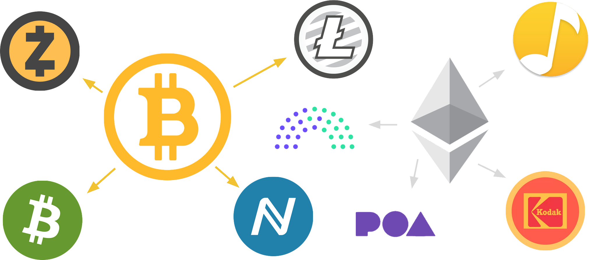

# Blockchain basics

Blockchain software enables individual computers—called nodes—to communicate with each other to form a decentralized peer-to-peer (P2P) network.
To ensure the security of the data on the chain and the ongoing progress of the chain, the nodes use some form of consensus to agree on the state of data in each block of data and the order in which the blocks are processed.

## What is a blockchain node?

At a high level, a blockchain node consists of the following key components:

- [Storage](/v3/advanced/storage)
- [Peer-to-peer networking](https://libp2p.io)
- [Consensus capabilities](/v3/advanced/consensus)
- Data handling capabilities for external or ["extrinsic"](/v3/concepts/extrinsics) information
- A [Runtime](/v3/concepts/runtime)

Because of the complexity involved in building these components, most blockchain projects are forked from an existing blockchain project.
For example, the Bitcoin repository was forked to create: Litecoin, ZCash, Namecoin, and Bitcoin Cash. Similarly, the Ethereum repository was forked to create Quorum, POA Network, KodakCoin, and Musicoin.

However, the existing blockchain platforms were not designed to allow for modification.
As a result, building a new blockchain by forking has serious limitations.

## What is Substrate?

Substrate is an open source, modular, and extensible framework for building blockchains.

Substrate is designed to be flexible and allow innovators to design and build a blockchain network that meets their needs.
It provides all the core components you need to build a customized blockchain node.

## Where to go next

Explore the following resources to learn more.

#### Tell me (read related topics)

* [Fundamentals](../fundamentals.md)
* 
* 

#### Guide me (related tutorials)

* [Build a local blockchain](../../tutorials/build-local-blockchain.md)
* [Simulate a two-node network](../../tutorials/simulate-two-node-network.md)
* [Start a private network](../../tutorials/start-a-private-network.md)

#### Show me (related video content)

* 
* 
* 

#### Teach me (how to)

* 
* 
* 

If you prefer to explore code directly, you can start building in the Developer Playground and consult the API reference to get details about the Rust crates you use.
