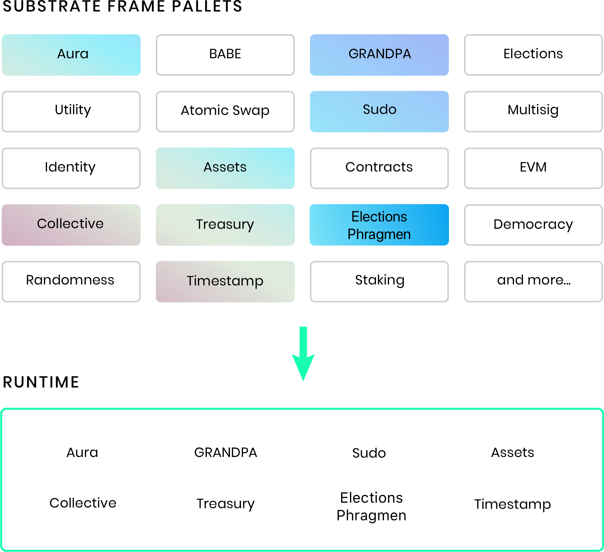

 
[WIP]

## FRAME primitives

Substrate comes with an opinionated toolkit for building runtimes in Rust called FRAME.
That said, the runtime can be built in any way, with any language, so long as it can communicate to the client.

The core Substrate codebase ships with [FRAME](/v3/runtime/frame), Parity's system for Substrate runtime development that is used for chains like [Kusama](https://github.com/paritytech/polkadot/blob/master/runtime/kusama/src/lib.rs) and [Polkadot](https://github.com/paritytech/polkadot/blob/master/runtime/polkadot/src/lib.rs). 
FRAME defines additional runtime primitives and provides a framework that makes it easy to construct a runtime by composing modules, called [pallets](/v3/runtime/frame#pallets). 
Each pallet encapsulates domain-specific logic that is expressed as a set of a [storage items](/v3/runtime/storage), [events](/v3/runtime/events-and-errors), [errors](/v3/runtime/events-and-errors#errors), and [dispatchable functions](/v3/getting-started/glossary#dispatch). 
FRAME developers can [create their own pallets](/v3/runtime/frame#pallets) and reuse existing pallets, including [over 50 of those shipped with Substrate](/v3/runtime/frame#prebuilt-pallets).



There are an additional set of primitives that are assumed about a runtime built with the Substrate FRAME. These are:

- `Call`: The dispatch type that can be called via an extrinsic.

- `Origin`: Represents where a call came from. For example, a signed message (a transaction), an
  unsigned message (an inherent extrinsic), or a call from the runtime itself (a root call).

- `Index`: An account index (aka nonce) type. This stores the number of previous transactions
  associated with a sender account.

- `Hashing`: The hashing algorithm being used in the runtime (e.g. Blake2).

- `AccountId`: The type used to identify user accounts in the runtime.

- `Event`: The type used for events emitted by the runtime.

- `Version`: A type which represents the version of the runtime.

Although a lot of core runtime development can be enabled with FRAME and
its related primitives, FRAME is not the only system for developing
Substrate based blockchains.

## Next steps

### Learn more

- Learn about the [Substrate FRAME](/v3/runtime/frame).
- Follow a
  [tutorial to develop your first Substrate chain](/tutorials/v3/create-your-first-substrate-chain).
- Follow a [tutorial to add a pallet to your Substrate runtime](/tutorials/v3/add-a-pallet).

### References

- See the
  [primitive types defined in `node-primitives`](/rustdocs/latest/node_primitives/index.html).

- See the
  [`traits` defined in `sp-runtime`](/rustdocs/latest/sp_runtime/traits/index.html).


**Weights**

Gav: In general, pallets should be written such that it’s impossible for a block to need more weight than the max. There are two occasions where we have historically relaxed this: upgrades and migrations. But in general (and especially for parachains) this won’t work
So it’s best to structure code so that it cannot have unbounded weight.
If it looks like code might need more weight than the block’s max, then that code might need reworking so that it can reduce or split its functionality at a pinch.
 
If a block’s weight is too large then it basically just means that other validators will be unable/unwilling to import it.
This is the desired outcome for a malicious block.
 
Shawn: I think another point to mention about weights is that everything is relative. An overweight block represents a block that takes more than than the allocated time on a specified hardware. People running faster machines are going to be able to import "overweight" blocks no problem. People who are running very crappy computers are not going to be able to import underweight blocks in time.
 
The whole thing we are trying to prevent is that good nodes should not miss their allocated block production slot because someone produced a block that is too big, and then takes them too long to import before they can go ahead and make their own block.
 
Imagine an attack where we know all computers on the network are exactly on par with another. Then a malicious actor would run a bunch of powerful machines, and somehow construct a block which is weighed incorrectly, and is actually very expensive to execute. It would be possible they submit this block a lot, and then the only machines that would be able to keep up and continue to produce blocks would be those powerful nodes. Other nodes would just be constantly behind trying to import blocks.
 
Finally, our weight calculations are known to be quite conservative. We test everything in worst case scenario, and have assumed quite a bit of overhead which does not actually exist in regular blocks. https://www.shawntabrizi.com/substrate-graph-benchmarks/docs/#/results
So we have overestimated the weight of transfer_keep_alive by 50%.
So weights are inherently a bit flexible, but our goal with benchmarking is to be as close to truth as possible about the time to execute some logic, and there is plenty of room to continue and improve that

**Order of pallets (pallet hooks).**

See: https://github.com/paritytech/substrate/blob/9689a131a595b99e60f134d7634f5f4d71969410/frame/support/procedural/src/lib.rs#L347-L351 
/// The population of the genesis storage depends on the order of pallets. So, if one of your
/// pallets depends on another pallet, the pallet that is depended upon needs to come before
/// the pallet depending on it.
→ Explain how this relates to on_initialize
→ Linked PR: https://github.com/paritytech/substrate/pull/10043 
 
to be more precise we should also say that frame_system is executed first, no matter its position.


**storage**

FRAME macros are used to hash storage items, encode and decode them.
Commonly used hashers in Substrate are: [`Blake2_128`](https://docs.substrate.io/rustdocs/latest/frame_support/struct.Blake2_128.html), [`Blake2_128`](https://docs.substrate.io/rustdocs/latest/frame_support/struct.Blake2_256.html), [`Twox128`](https://docs.substrate.io/rustdocs/latest/frame_support/struct.Twox128.html) and [`Twox256`](https://docs.substrate.io/rustdocs/latest/frame_support/struct.Twox256.html).

## Trie abstraction

Substrate does not use [reference counting](http://en.wikipedia.org/wiki/Reference_counting) for performance reasons.

Tries allow efficient storing and sharing of the historical block state. 
The trie root is a representation of the data within the trie: two tries with different data will always have different roots. 
Thus, two blockchain nodes can easily verify that they have the same state by simply comparing their trie roots.

One advantage of using a simple key-value store is that you are able to easily abstract storage
structures on top of it.

Accessing trie data is costly. Each read operation takes O(log N) time, where N is the number of elements stored in the trie. To mitigate this, we use a key-value cache.

### Child trie

Child tries are identical to the main state trie, except that a child trie's root is stored and
updated as a node in the main trie instead of the block header. Since their headers are a part of
the main state trie, it is still easy to verify the complete node state when it includes child
tries.

Child tries are useful when you want your own independent trie with a separate root hash that you
can use to verify the specific content in that trie. Subsections of a trie do not have a
root-hash-like representation that satisfy these needs automatically; thus a child trie is used
instead.

## Querying storage

Blockchains that are built with Substrate expose a remote procedure call (RPC) server that can be
used to query runtime storage. When you use the Substrate RPC to access a storage item, you only
need to provide [the key](#key-value-database) associated with that item.
[Substrate's runtime storage APIs](/v3/runtime/storage) expose a number of storage item types; keep
reading to learn how to calculate storage keys for the different types of storage items.

### Storage value keys

To calculate the key for a simple [Storage Value](/v3/runtime/storage#storage-value), take the
[TwoX 128 hash](https://github.com/Cyan4973/xxHash) of the name of the pallet that contains the
Storage Value and append to it the TwoX 128 hash of the name of the Storage Value itself. For
example, the [Sudo](/rustdocs/latest/pallet_sudo/index.html) pallet exposes a
Storage Value item named
[`Key`](/rustdocs/latest/pallet_sudo/struct.Module.html#method.key):

```
twox_128("Sudo")                   = "0x5c0d1176a568c1f92944340dbfed9e9c"
twox_128("Key")                    = "0x530ebca703c85910e7164cb7d1c9e47b"
twox_128("Sudo") + twox_128("Key") = "0x5c0d1176a568c1f92944340dbfed9e9c530ebca703c85910e7164cb7d1c9e47b"
```

If the familiar `Alice` account is the sudo user, an RPC request and response to read the Sudo
pallet's `Key` Storage Value could be represented as:

```
state_getStorage("0x5c0d1176a568c1f92944340dbfed9e9c530ebca703c85910e7164cb7d1c9e47b") = "0xd43593c715fdd31c61141abd04a99fd6822c8558854ccde39a5684e7a56da27d"
```

In this case, the value that is returned
(`"0xd43593c715fdd31c61141abd04a99fd6822c8558854ccde39a5684e7a56da27d"`) is Alice's
[SCALE](../scale-codec)-encoded account ID (`5GrwvaEF5zXb26Fz9rcQpDWS57CtERHpNehXCPcNoHGKutQY`).

You may have noticed that the
[non-cryptographic](/v3/runtime/storage#cryptographic-hashing-algorithms) TwoX 128 hash algorithm is
used to generate Storage Value keys. This is because it is not necessary to pay the performance
costs associated with a cryptographic hash function since the input to the hash function (the names
of the pallet and storage item) are determined by the runtime developer and not by potentially
malicious users of your blockchain.

### Storage map keys

Like Storage Values, the keys for [Storage Maps](/v3/runtime/storage#storage-map) are equal to the
TwoX 128 hash of the name of the pallet that contains the map prepended to the TwoX 128 hash of the
name of the Storage Map itself. To retrieve an element from a map, simply append the hash of the
desired map key to the storage key of the Storage Map. For maps with two keys (Storage Double Maps),
append the hash of the first map key followed by the hash of the second map key to the Storage
Double Map's storage key. Like Storage Values, Substrate will use the TwoX 128 hashing algorithm for
the pallet and Storage Map names, but you will need to make sure to use the correct
[hashing algorithm](/v3/runtime/storage#hashing-algorithms) (the one that was declared in
[the `#[pallet::storage]` macro](/v3/runtime/storage#declaring-storage-items)) when determining the hashed
keys for the elements in a map.

Here is an example that illustrates querying a Storage Map named `FreeBalance` from a pallet named
"Balances" for the balance of the familiar `Alice` account. In this example, the `FreeBalance` map
is using
[the transparent Blake2 128 Concat hashing algorithm](/v3/runtime/storage#transparent-hashing-algorithms):

```
twox_128("Balances")                                             = "0xc2261276cc9d1f8598ea4b6a74b15c2f"
twox_128("FreeBalance")                                          = "0x6482b9ade7bc6657aaca787ba1add3b4"
scale_encode("5GrwvaEF5zXb26Fz9rcQpDWS57CtERHpNehXCPcNoHGKutQY") = "0xd43593c715fdd31c61141abd04a99fd6822c8558854ccde39a5684e7a56da27d"

blake2_128_concat("0xd43593c715fdd31c61141abd04a99fd6822c8558854ccde39a5684e7a56da27d") = "0xde1e86a9a8c739864cf3cc5ec2bea59fd43593c715fdd31c61141abd04a99fd6822c8558854ccde39a5684e7a56da27d"

state_getStorage("0xc2261276cc9d1f8598ea4b6a74b15c2f6482b9ade7bc6657aaca787ba1add3b4de1e86a9a8c739864cf3cc5ec2bea59fd43593c715fdd31c61141abd04a99fd6822c8558854ccde39a5684e7a56da27d") = "0x0000a0dec5adc9353600000000000000"
```

The value that is returned from the storage query (`"0x0000a0dec5adc9353600000000000000"` in the
example above) is the [SCALE](../scale-codec)-encoded value of Alice's account balance
(`"1000000000000000000000"` in this example). Notice that before hashing Alice's account ID it has
to be SCALE-encoded. Also notice that the output of the `blake2_128_concat` function consists of 32
hexadecimal characters followed by the function's input. This is because the Blake2 128 Concat is
[a transparent hashing algorithm](/v3/runtime/storage#transparent-hashing-algorithms). Although the
above example may make this characteristic seem superfluous, its utility becomes more apparent when
the goal is to iterate over the keys in a map (as opposed to retrieving the value associated with a
single key). The ability to iterate over the keys in a map is a common requirement in order to allow
_people_ to use the map in a way that seems natural (such as UIs): first, a user is presented with a
list of elements in the map, then, that user can select the element that they are interested in and
query the map for more details about that particular element. Here is another example that uses the
same example Storage Map (a map named `FreeBalances` that uses a Blake2 128 Concat hashing algorithm
in a pallet named "Balances") that will demonstrate using the Substrate RPC to query a Storage Map
for its list of keys via the `state_getKeys` RPC endpoint:

```
twox_128("Balances")                                      = "0xc2261276cc9d1f8598ea4b6a74b15c2f"
twox_128("FreeBalance")                                   = "0x6482b9ade7bc6657aaca787ba1add3b4"

state_getKeys("0xc2261276cc9d1f8598ea4b6a74b15c2f6482b9ade7bc6657aaca787ba1add3b4") = [
	"0xc2261276cc9d1f8598ea4b6a74b15c2f6482b9ade7bc6657aaca787ba1add3b4de1e86a9a8c739864cf3cc5ec2bea59fd43593c715fdd31c61141abd04a99fd6822c8558854ccde39a5684e7a56da27d",
	"0xc2261276cc9d1f8598ea4b6a74b15c2f6482b9ade7bc6657aaca787ba1add3b432a5935f6edc617ae178fef9eb1e211fbe5ddb1579b72e84524fc29e78609e3caf42e85aa118ebfe0b0ad404b5bdd25f",
	...
]
```

Each element in the list that is returned by the Substrate RPC's `state_getKeys` endpoint can be
directly used as input for the RPC's `state_getStorage` endpoint. In fact, the first element in the
example list above is equal to the input used for the `state_getStorage` query in the previous
example (the one used to find the balance for `Alice`). Because the map that these keys belong to
uses a transparent hashing algorithm to generate its keys, it is possible to determine the account
associated with the second element in the list. Notice that each element in the list is a
hexadecimal value that begins with the same 64 characters; this is because each list element
represents a key in the same map, and that map is identified by concatenating two TwoX 128 hashes,
each of which are 128-bits or 32 hexadecimal characters. After discarding this portion of the second
element in the list, you are left with
`0x32a5935f6edc617ae178fef9eb1e211fbe5ddb1579b72e84524fc29e78609e3caf42e85aa118ebfe0b0ad404b5bdd25f`.

You saw in the previous example that this represents the Blake2 128 Concat hash of some
[SCALE](../scale-codec)-encoded account ID. The Blake 128 Concat hashing algorithm consists of appending
(concatenating) the hashing algorithm's input to its Blake 128 hash. This means that the first 128
bits (or 32 hexadecimal characters) of a Blake2 128 Concat hash represents a Blake2 128 hash, and
the remainder represents the value that was passed to the Blake 2 128 hashing algorithm. In this
example, after you remove the first 32 hexadecimal characters that represent the Blake2 128 hash
(i.e. `0x32a5935f6edc617ae178fef9eb1e211f`) what is left is the hexadecimal value
`0xbe5ddb1579b72e84524fc29e78609e3caf42e85aa118ebfe0b0ad404b5bdd25f`, which is a
[SCALE](../scale-codec)-encoded account ID. Decoding this value yields the result
`5GNJqTPyNqANBkUVMN1LPPrxXnFouWXoe2wNSmmEoLctxiZY`, which is the account ID for the familiar
`Alice_Stash` account.

## Runtime storage API

Substrate's [FRAME Support crate](/rustdocs/latest/frame_support/index.html)
provides utilities for generating unique, deterministic keys for your runtime's storage items. These
storage items are placed in the [state trie](#trie-abstraction) and are accessible by
[querying the trie by key](#querying-storage).